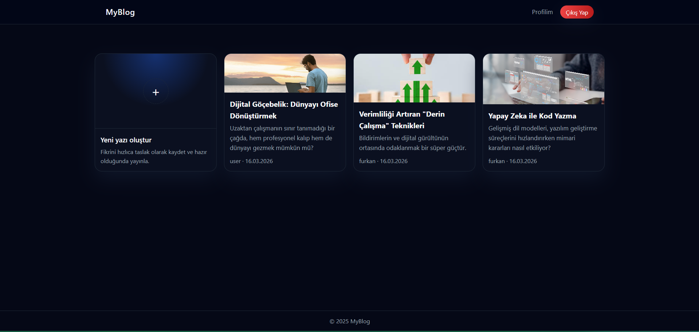
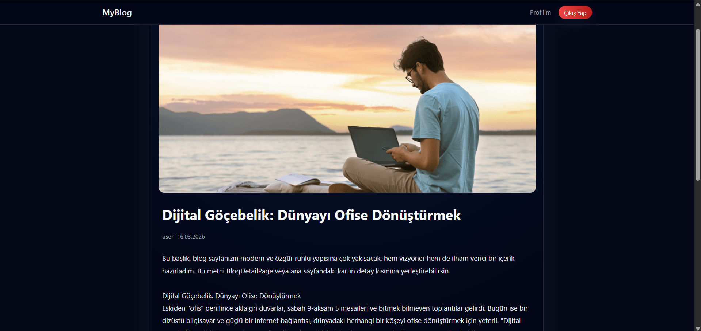
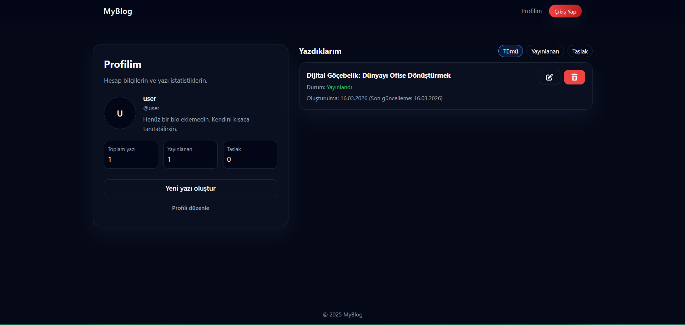

# MyBlog - Full-Stack Blog Application

A modern, full-stack blog application built with React frontend and Node.js backend, featuring user authentication, blog post management, and a responsive design.

## 🌟 Features

- **User Authentication**: Secure registration and login with JWT tokens
- **Post Management**: Create, edit, delete, and publish blog posts
- **Draft & Status System**: Draft / published status, publish date, estimated reading time
- **Rich Authoring Experience**:
  - Dark, distraction-free editor
  - Live preview mode
  - Line breaks and formatting preserved on the detail page
- **Cover Images**:
  - Upload images from your computer (stored on the backend)
  - Or use any external image URL
- **Modern Feed Layout**:
  - Square cards with optional cover image, title, teaser, author and date
  - First card is a “New Post” shortcut matching the grid layout
- **Profile Dashboard**:
  - Avatar, display name, bio
  - Post stats (total, published, drafts)
  - Filterable list: All / Published / Draft
- **Responsive Design**: Works seamlessly on desktop, tablet, and mobile
- **Dark UI**: Consistent dark theme across app, optimized for reading and writing

## 🛠️ Tech Stack

### Frontend
- **React 19** - Modern React with hooks and functional components
- **React Router DOM** - Client-side routing
- **Axios** - HTTP client for API requests
- **React Toastify** - User-friendly notifications
- **Font Awesome** - Icon library
- **CSS3** - Custom styling with responsive design

### Backend
- **Node.js** - JavaScript runtime
- **Express.js** - Web application framework
- **JWT** - JSON Web Tokens for authentication
- **Bcrypt.js** - Password hashing
- **CORS** - Cross-origin resource sharing
- **Dotenv** - Environment variable management
- **Multer** - File upload handling for cover images

### Database
- **PostgreSQL (Docker)** - Relational database
- **pg** - Node.js driver for PostgreSQL

## 📋 Prerequisites

Before running this application, make sure you have the following installed:

- **Node.js** (v16 or higher)
- **npm** or **yarn**
- **Docker Desktop** (for running PostgreSQL)
- **Git**

## 🚀 Quick Start

### 1. Clone the Repository

```bash
git clone https://github.com/furblood0/my-blog-project.git
cd my-blog-project
```

### 2. Install Dependencies

```bash
# Install all dependencies (root, frontend, and backend)
npm run install-all
```

### 3. Database Setup (Docker + PostgreSQL)

1. **Docker ile PostgreSQL ve şema kurulumunu başlat**:

```bash
docker-compose down -v  # (İlk kurulumda veya sıfırlamak istediğinde)
docker-compose up -d
```

- `docker-compose.yml` içindeki `db` servisi (PostgreSQL) ayağa kalkar.
- `db-init/database-schema-postgres.sql` dosyası, PostgreSQL ilk kez başlarken otomatik çalıştırılır ve tablolar oluşturulur.

> Not: Veritabanı şeması; kullanıcı meta alanlarını (`display_name`, `avatar_url`, `bio`, `role`) ve yazı alanlarını (`slug`, `status`, `published_at`, `reading_time`) içerir.

### 4. Environment Configuration

#### Backend Configuration
```bash
cd blog-backend
cp env.example .env
```

Edit `blog-backend/.env`:
```env
PORT=5000
DB_HOST=localhost
DB_PORT=5432
DB_DATABASE=blogdb
DB_USER=your_username
DB_PASSWORD=your_password
JWT_SECRET=your_super_secret_jwt_key_here_make_it_long_and_random
CORS_ORIGIN=http://localhost:3000
```

#### Frontend Configuration
```bash
cd project1
cp env.example .env
```

Edit `project1/.env`:
```env
REACT_APP_API_URL=http://localhost:5000/api
REACT_APP_NAME=MyBlog
REACT_APP_VERSION=1.0.0
```

### 5. Start the Application

#### Development Mode (Both Frontend and Backend)
```bash
# From the root directory
npm run dev
```

#### Or Start Separately
```bash
# Start Backend
npm run start-backend

# Start Frontend (in a new terminal)
npm run start-frontend
```

The application will be available at:
- **Frontend**: http://localhost:3000
- **Backend API**: http://localhost:5000
- **Uploaded Images**: http://localhost:5000/uploads/...

## 📁 Project Structure

```
my-blog-project/
├── blog-backend/           # Backend API
│   ├── config/
│   │   └── db.js          # Database configuration
│   ├── middleware/
│   │   └── auth.js        # JWT authentication middleware
│   ├── uploads/           # Uploaded cover images (served at /uploads)
│   ├── server.js          # Main server file (REST API + file upload endpoint)
│   ├── package.json
│   └── env.example        # Environment variables template
├── project1/              # Frontend React app
│   ├── public/
│   ├── src/
│   │   ├── components/    # React components
│   │   ├── context/       # React context
│   │   ├── services/      # API services
│   │   └── App.js         # Main app component
│   ├── package.json
│   └── env.example        # Environment variables template
├── db-init/               # PostgreSQL init scripts (used by Docker)
│   └── database-schema-postgres.sql
├── database-schema.sql    # Legacy SQL Server schema
├── package.json           # Root package.json
├── .gitignore
└── README.md
```

## 🔧 Available Scripts

### Root Directory
- `npm run install-all` - Install dependencies for all projects
- `npm run dev` - Start both frontend and backend in development mode
- `npm run start-backend` - Start only the backend server
- `npm run start-frontend` - Start only the frontend development server
- `npm run build` - Build the frontend for production
- `npm run test` - Run frontend tests

### Backend Directory
- `npm start` - Start the production server
- `npm run dev` - Start the development server with nodemon

### Frontend Directory
- `npm start` - Start the development server
- `npm run build` - Build for production
- `npm test` - Run tests
- `npm run eject` - Eject from Create React App

## 🔐 API Endpoints

### Authentication
- `POST /api/register` - User registration
- `POST /api/login` - User login

### Posts
- `GET /api/posts` - Get all published posts
- `GET /api/posts/:id` - Get a specific post
- `POST /api/posts` - Create a new post (authenticated)
- `PUT /api/posts/:id` - Update a post (authenticated)
- `DELETE /api/posts/:id` - Delete a post (authenticated)

### User Profile
- `GET /api/users/:id/profile` - Get user profile and posts (authenticated)

## 🧪 Testing

```bash
# Run frontend tests
cd project1
npm test

# Run tests in watch mode
npm test -- --watch
```

## 🚀 Deployment

### Frontend Deployment
```bash
cd project1
npm run build
```

The build folder can be deployed to:
- Netlify
- Vercel
- GitHub Pages
- AWS S3

### Backend Deployment
The backend can be deployed to:
- Heroku
- Railway
- DigitalOcean
- AWS EC2
- Azure App Service

## 🖼️ Screenshots

### Dashboard (Feed)



### Post Detail



### Profile



## 🤝 Contributing

1. Fork the repository
2. Create your feature branch (`git checkout -b feature/AmazingFeature`)
3. Commit your changes (`git commit -m 'Add some AmazingFeature'`)
4. Push to the branch (`git push origin feature/AmazingFeature`)
5. Open a Pull Request

## 📝 License

This project is licensed under the MIT License - see the [LICENSE](LICENSE) file for details.

## 👨‍💻 Author

**Furkan Fidan**
- GitHub: [@furblood0](https://github.com/furblood0)

## 🙏 Acknowledgments

- React team for the amazing framework
- Express.js community for the robust backend framework
- Microsoft for SQL Server
- All the open-source contributors whose libraries made this project possible

## 📞 Support

If you have any questions or need help, please open an issue on GitHub or contact me directly.

---

⭐ If you found this project helpful, please give it a star on GitHub!
